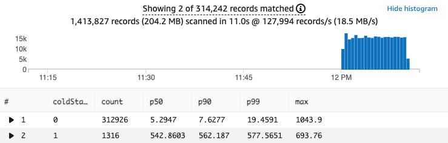

## Serverless GraalVM Demo


<p align="center">
  
</p>

This is a simple serverless application built in Java and uses the GraalVM native-image tool. It consists of an
[Amazon API Gateway](https://aws.amazon.com/api-gateway/) backed by four [AWS Lambda](https://aws.amazon.com/lambda/)
functions and an [Amazon DynamoDB](https://aws.amazon.com/dynamodb/) table for storage.

## Requirements

- [AWS CLI](https://aws.amazon.com/cli/)
- [AWS CDK](https://aws.amazon.com/cdk/)
- Java 11
- Maven
- [Artillery](https://www.artillery.io/) for load-testing the application

## Software

Within the software folder is the products maven project. This single maven project contains all the code for all four
Lambda functions. It uses the hexagonal architecture pattern to decouple the entry points, from the main domain logic
and the storage logic.

### Custom Runtime

The GraalVM native-image tool will produce a stand-alone executable binary. This does not require the JVM to run. To run
our application on Lambda we must make
a [custom runtime](https://docs.aws.amazon.com/lambda/latest/dg/runtimes-custom.html)
and implement the [Lambda Runtime API](https://docs.aws.amazon.com/lambda/latest/dg/runtimes-api.html). This is done my
including the `aws-lambda-java-runtime-interface-client` dependency in our project.
The [maven assembly build plugin](https://github.com/aws-samples/serverless-graalvm-demo/blob/main/software/products/src/assembly/zip.xml)
is used to create a zip file which includes the executable binary as well as the entry
point [bootstrap](https://github.com/aws-samples/serverless-graalvm-demo/blob/main/software/products/src/main/config/bootstrap)
file.

<p align="center">
  
</p>

## Infrastructure

### Deployment

Deploy the demo to your AWS account using [AWS CDK](https://aws.amazon.com/cdk/).

```bash
cdk deploy
```

The command `cdk deploy` will first build the products maven project using a docker build image with all the required
GraalVM tools. Then it will use AWS CloudFormation to deploy the resources to your account.

CDK will create an output of the API Gateway endpoint URL for future use in our load tests.

## Load Test

[Artillery](https://www.artillery.io/) is used to make 300 requests / second for 10 minutes to our API endpoints. You
can run this with the following command.

```bash
cd load-test
./run-load-test.sh
```

This is a demanding load test, to change the rate alter the `arrivalRate` value in `load-test.yml`.

### CloudWatch Logs Insights

Using this CloudWatch Logs Insights query you can analyse the latency of the requests made to the Lambda functions.

The query separates cold starts from other requests and then gives you p50, p90 and p99 percentiles.

```
filter @type="REPORT"
| fields greatest(@initDuration, 0) + @duration as duration, ispresent(@initDuration) as coldStart
| stats count(*) as count, pct(duration, 50) as p50, pct(duration, 90) as p90, pct(duration, 99) as p99, max(duration) as max by coldStart
```

<p align="center">
  
</p>

## AWS X-Ray Tracing

You can add additional detail to your X-Ray tracing by adding a TracingInterceptor to your AWS SDK clients. Here is the
code for my DynamoDbClient from
the [DynamoDbProductStore](https://github.com/aws-samples/serverless-graalvm-demo/blob/aws-xray-support/software/products/src/main/java/software/amazonaws/example/product/store/dynamodb/DynamoDbProductStore.java)
class.

```java
private final DynamoDbClient dynamoDbClient=DynamoDbClient.builder()
        .credentialsProvider(EnvironmentVariableCredentialsProvider.create())
        .region(Region.of(System.getenv(SdkSystemSetting.AWS_REGION.environmentVariable())))
        .overrideConfiguration(ClientOverrideConfiguration.builder()
        .addExecutionInterceptor(new TracingInterceptor())
        .build())
        .build();
```

Example cold start trace

<p align="center">
  
</p>

Example warm start trace

<p align="center">
  
</p>

## 👀 With other languages

You can find implementations of this project in other languages here:

* [🦀 Rust](https://github.com/aws-samples/serverless-rust-demo)
* [🏗️ TypeScript](https://github.com/aws-samples/serverless-typescript-demo)

## Security

See [CONTRIBUTING](CONTRIBUTING.md#security-issue-notifications) for more information.

## License

This library is licensed under the MIT-0 License. See the LICENSE file.

